# 내 컴퓨터에 개발자용 작업실 꾸미기

## 프로젝트 개요
Docker와 Docker Compose를 활용하여 Flask + PostgreSQL 메모장 API를 
컨테이너 환경에서 구축하는 프로젝트

## 실행 환경
- OS: macOS (darwin/arm64)
- Shell: zsh
- Terminal: iTerm2
- Docker: 20.10.21
- Git: 2.39.5

## 수행 항목 체크 리스트
- [x] 터미널 환경 구성
- [x] Docker 설치 및 기본 점검
- [x] Dockerfile 작성 및 이미지 빌드
- [x] 포트 포워딩 (-p 옵션)
- [x] 볼륨 영속성 검증
- [x] Docker Compose 멀티 컨테이너 실행
- [x] Compose 운영 명령어 (up/down/ps/logs)
- [x] Git/GitHub 업로드

## 검증 방법

### 도커 생성 및 명령어 확인
| 검증 항목 | 명령어 | 결과 위치 |
|-----------|--------|-----------|
| 도커 버전 | `docker --version` | [바로가기](#도커-버전-확인-docker---version) |
| 데몬 동작 | `docker info` | [바로가기](#도커-데몬-동작-여부-기록-docker-info) |
| 이미지 목록 | `docker images` | [바로가기](#이미지-다운로드목록-확인) |
| 컨테이너 목록 | `docker ps -a` | [바로가기](#컨테이너-실행중지목록) |
| 로그 확인 | `docker logs -f` | [바로가기](#docker-logs) |
| 리소스 확인 | `docker stats` | [바로가기](#docker-stats) |

### 우분투 조작 및 명령어 확인
| 검증 항목 | 명령어 | 결과 위치 |
|-----------|--------|-----------|
| 파일 조작 | `pwd/ls/mkdir/touch/cat` | [바로가기](#위치-확인-및-파일-조작) |
| 권한 설정 | `chmod 755/700` | [바로가기](#파일-권한-변경-및-실행) |
| 사용자 권한 차단 | `useradd + su` | [바로가기](#권한에-따른-수행-확인) |

### 도커 컴포즈 생성 및 조작
| 검증 항목 | 명령어 | 결과 위치 |
|-----------|--------|-----------|
| 멀티 컨테이너 실행 | `docker compose up --build` | [바로가기](#도커-컴포즈) |
| API 동작 확인 | `curl POST/GET /memo` | [바로가기](#도커-컴포즈) |
| 볼륨 영속성 | `docker compose down && up` | [바로가기](#도커-볼륨-영속성-검증) |
| 백그라운드 실행 | `docker compose up -d` | [바로가기](#compose-운영-명령어) |
| 상태 확인 | `docker compose ps` | [바로가기](#compose-운영-명령어) |
| 로그 확인 | `docker compose logs` | [바로가기](#compose-운영-명령어) |
| 종료 | `docker compose down` | [바로가기](#compose-운영-명령어) |

### Git / GitHub 설정
```shell
git config --list
remote.origin.url=git@github.com:KKamtte/codyssey.git
remote.origin.fetch=+refs/heads/*:refs/remotes/origin/*
branch.main.remote=origin
branch.main.merge=refs/heads/main
branch.developer-workroom.remote=origin
branch.developer-workroom.merge=refs/heads/developer-workroom
```
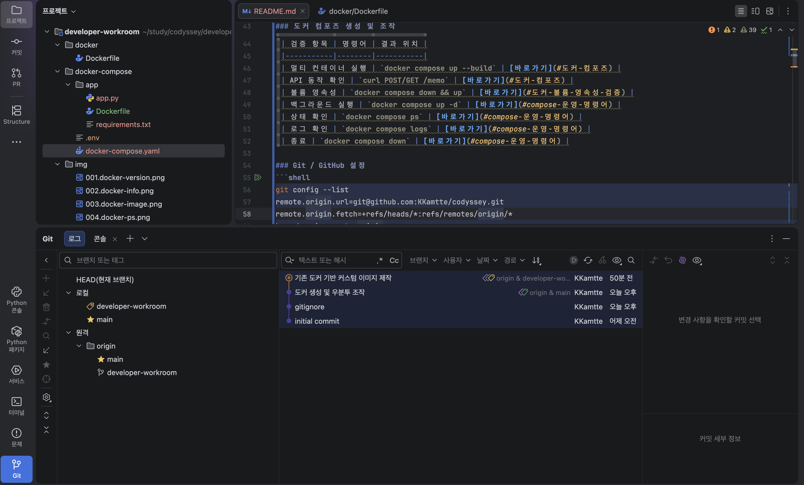

### 도커 설치 및 기본 점검
#### hello-world
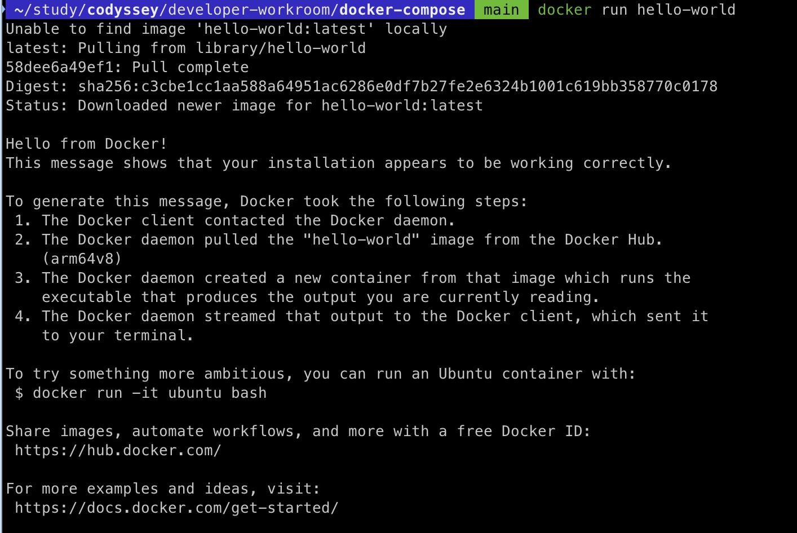

#### 도커 버전 확인 (docker --version)
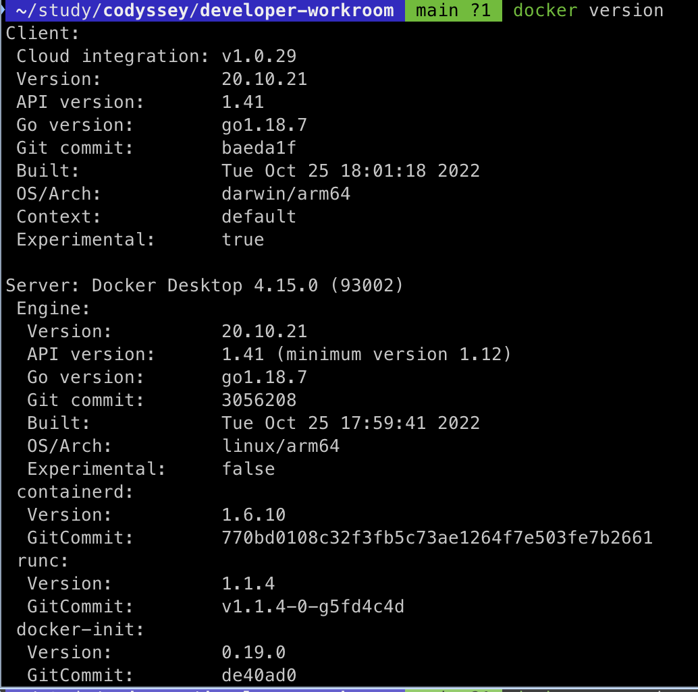
1. Client-Server (CS구조)
- client: 현재 도커를 이용하는 영역
- server: 실제로 컨테이너를 만들고 실행하는 엔진
2. OS/Arch (운영체제 및 아키텍처)
- client: `darwin/arm64`
- server: `linux/arm64`
3. Version
- 도커 엔진의 버전

#### 도커 데몬 동작 여부 기록 (docker info)
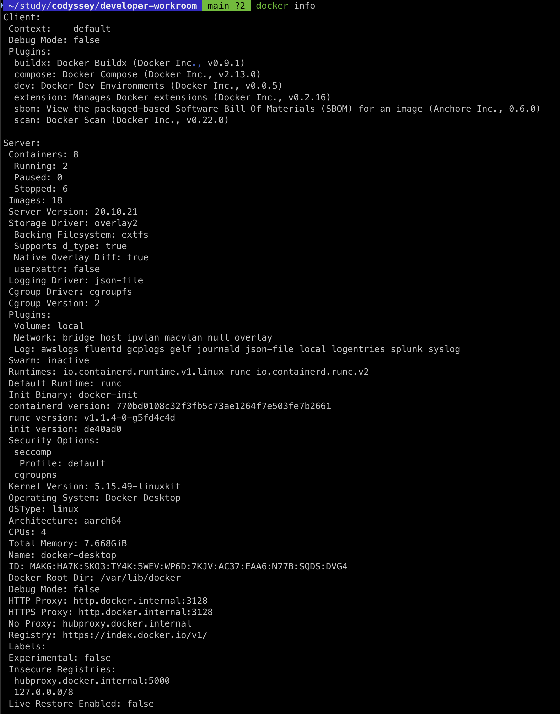
1. 리소스 사용 현황
- Containers: 8 (Running: 2, Paused: 0, Stopped: 6)
- Image: 18
- 도커 엔진에 저장된 이미지의 개수는 18개 이며, 8개의 컨테이너가 만들어져 있음. 이 중 2개는 현재 실행 중
2. 할당된 하드웨어 사양
- CPUs: 4
- Total Memory: 7.668GiB
- 전체 자원 중 도커가 가져다 쓸 수 있도록 빌려준 자원의 양
3. 저장소 드라이버
- Storage Driver: overlay2
- 도커가 레이어를 쌓아서 이미지를 관리하는 방식. `overlay2`는 가장 표준적이고 성능이 좋음
4. 아키텍처
- Architecture: aarch64
- 클라이언트의 아키텍처

### 도커 기본 운영 명령
#### 이미지: 다운로드/목록 확인
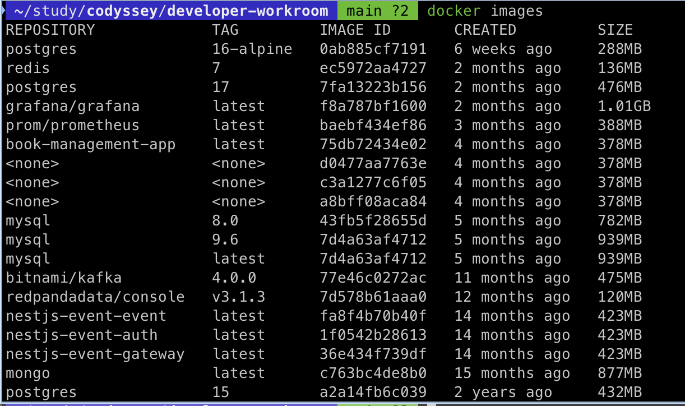
1. <none> 이미지
- 댕글링(Dangling)이미지: 목록 중간에 이름도 태그도 없는 `<none>` 이미지
- 원인: 같은 이름의 이미지를 다시 빌드 할 때, 기존 이미지가 이름표를 뺏기고 껍데기만 남는 경우
- 조치: 특별히 쓸 일이 없다면 삭제
2. IMAGE ID 가 같은 경우 
- mysql 의 9.6 태그와 latest 태그의 IMAGE ID 가 동일
- 두 이미지의 태그만 다를뿐 물리적으로 같은 파일로 용량도 중복으로 차지하지 않음
3. SIZE
- grafana는 1G 가 넘고 redis 는 136MB, 이미지가 무거울수록 배포 속도가 느려짐
4. 옵션
1) 댕글링 이미지만 모아 보기
```shell
docker images -f "dangling=true"
REPOSITORY   TAG       IMAGE ID       CREATED        SIZE
<none>       <none>    d0477aa7763e   4 months ago   378MB
<none>       <none>    c3a1277c6f05   4 months ago   378MB
<none>       <none>    a8bff08aca84   4 months ago   378MB
```
2) 이미지 ID 만 출력하기
```shell
docker images -q
0ab885cf7191
ec5972aa4727
7fa13223b156
f8a787bf1600
baebf434ef86
```
3) 내가 원하는 정보만 모아보기
```shell
docker images --format "table {{.Repository}}\t{{.Tag}}\t{{.Size}}"
REPOSITORY             TAG         SIZE
postgres               16-alpine   288MB
redis                  7           136MB
postgres               17          476MB
grafana/grafana        latest      1.01GB
```

#### 컨테이너: 실행/중지/목록
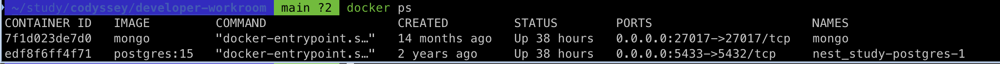
1. STATUS
- 내용: Up 38 hours
- 의미: 38시간 동안 한 번도 꺼지지 않고 계속 돌아가고 있음. 문제가 생겨서 재시작될 경우 `Restarting`이나 시간이 짧게 표시
2. PORTS
- mongo: `0.0.0.0:27017 -> 27017/tcp` (내 컴퓨터 27017로 접속하면 컨테이너의 27017로 연결됨)
- postgres: `0.0.0.0:5433 -> 5432/tcp` (내 컴퓨터 5433 으로 접속하면 컨테이너의 5432로 연결됨)
3. NAMES
- 내용: mongo, nest_study-postgres-1
- 의미: 컨테이너를 제어할때 ID 대신 이름을 사용하여 제어 가능
4. OPTIONS
1) 꺼져있는 컨테이너 까지 모두 보기
```shell
docker ps -a
CONTAINER ID   IMAGE                         COMMAND                  CREATED         STATUS                      PORTS                                              NAMES
6222bb534880   redis:7                       "docker-entrypoint.s…"   8 weeks ago     Exited (0) 7 weeks ago                                                         skip-lock-redis
693386db3a93   grafana/grafana:latest        "/run.sh"                2 months ago    Exited (0) 2 months ago                                                        grafana
33a924b5d119   prom/prometheus:latest        "/bin/prometheus --c…"   2 months ago    Exited (0) 2 months ago                                                        prometheus
```
2) 마지막으로 생성한 컨테이너만 보기
```shell
docker ps -l
CONTAINER ID   IMAGE     COMMAND                  CREATED       STATUS                   PORTS     NAMES
6222bb534880   redis:7   "docker-entrypoint.s…"   8 weeks ago   Exited (0) 7 weeks ago             skip-lock-redis
```
3) 요약해서 ID만 보기
```shell
docker ps -q
7f1d023de7d0
edf8f6ff4f71
```

#### 운영: 로그 확인, 리소스 확인
##### docker-logs
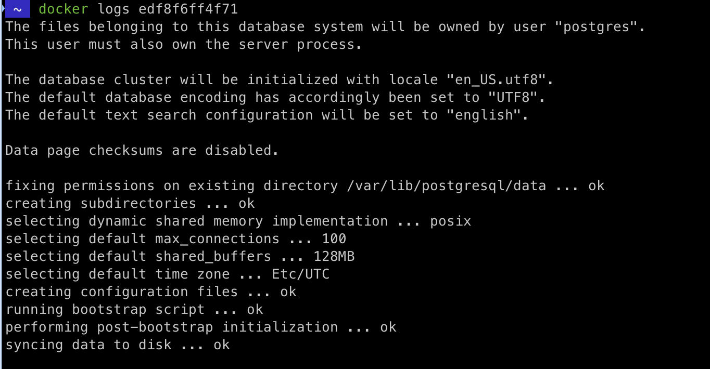
1. 실시간으로 로그 보기
```shell
docker logs -f edf8f6ff4f7
PostgreSQL Database directory appears to contain a database; Skipping initialization

2026-07-28 21:24:15.247 UTC [1] LOG:  starting PostgreSQL 15.4 (Debian 15.4-2.pgdg120+1) on aarch64-unknown-linux-gnu, compiled by gcc (Debian 12.2.0-14) 12.2.0, 64-bit
2026-07-28 21:24:15.248 UTC [1] LOG:  listening on IPv4 address "0.0.0.0", port 5432
2026-07-28 21:24:15.248 UTC [1] LOG:  listening on IPv6 address "::", port 5432
2026-07-28 21:24:15.254 UTC [1] LOG:  listening on Unix socket "/var/run/postgresql/.s.PGSQL.5432"
2026-07-28 21:24:15.354 UTC [30] LOG:  database system was shut down at 2026-06-20 13:38:20 UTC
2026-07-28 21:24:15.411 UTC [1] LOG:  database system is ready to accept connections
2026-07-28 21:29:15.372 UTC [28] LOG:  checkpoint starting: time
2026-07-28 21:29:15.416 UTC [28] LOG:  checkpoint complete: wrote 3 buffers (0.0%); 0 WAL file(s) added, 0 removed, 0 recycled; write=0.010 s, sync=0.002 s, total=0.045 s; sync files=2, longest=0.001 s, average=0.001 s; distance=0 kB, estimate=0 kB
```
2. 마지막 몇 줄만 보기
```shell
docker logs --tail 5 edf8f6ff4f71
2026-07-28 21:24:15.254 UTC [1] LOG:  listening on Unix socket "/var/run/postgresql/.s.PGSQL.5432"
2026-07-28 21:24:15.354 UTC [30] LOG:  database system was shut down at 2026-06-20 13:38:20 UTC
2026-07-28 21:24:15.411 UTC [1] LOG:  database system is ready to accept connections
2026-07-28 21:29:15.372 UTC [28] LOG:  checkpoint starting: time
2026-07-28 21:29:15.416 UTC [28] LOG:  checkpoint complete: wrote 3 buffers (0.0%); 0 WAL file(s) added, 0 removed, 0 recycled; write=0.010 s, sync=0.002 s, total=0.045 s; sync files=2, longest=0.001 s, average=0.001 s; distance=0 kB, estimate=0 kB
```
3. 로그에 시간 표시하기
```shell
docker logs -t edf8f6ff4f71
2026-07-28T21:24:15.354286875Z 2026-07-28 21:24:15.354 UTC [30] LOG:  database system was shut down at 2026-06-20 13:38:20 UTC
2026-07-28T21:24:15.411972875Z 2026-07-28 21:24:15.411 UTC [1] LOG:  database system is ready to accept connections
2026-07-28T21:29:15.373568417Z 2026-07-28 21:29:15.372 UTC [28] LOG:  checkpoint starting: time
2026-07-28T21:29:15.416463417Z 2026-07-28 21:29:15.416 UTC [28] LOG:  checkpoint complete: wrote 3 buffers (0.0%); 0 WAL file(s) added, 0 removed, 0 recycled; write=0.010 s, sync=0.002 s, total=0.045 s; sync files=2, longest=0.001 s, average=0.001 s; distance=0 kB, estimate=0 kB
```
4. 특정 시간 이후의 로그만 보기
```shell
docker logs --since 30m edf8f6ff4f71
```
---

##### docker-stats
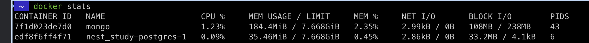
1. CPU %
- CPU 사용량
- 이 수치가 100% 에 가깝다면 컨테이너가 복잡한 연산 작업을 수행
2. MEM USAGE / LIMIT
- 메모리 사용량 / 제한
- 컨테이너의 메모리 사용량이 많이질수록 높아지며, 제한을 넘는경우 OOM 발생
3. NET I/O
- 네트워크 입출력
- 외부와 주고받는 데이터 양
4. BLOCK I/O
- 디스크 입출력
- 디스크에서 읽고 쓰는 수치
5. PIDS
- 프로세스 개수
- 현재 컨테이너는 43/6개의 프로세스 협력해서 돌고 있음
6. OPTIONS
1) 필요한 정보만 골라서 표 만들기
```shell
docker stats --format "table {{.Name}}\t{{.CPUPerc}}\t{{.MemUsage}}\t{{.NetIO}}"
NAME                    CPU %     MEM USAGE / LIMIT     NET I/O
mongo                   1.69%     184.4MiB / 7.668GiB   2.99kB / 0B
nest_study-postgres-1   0.01%     35.45MiB / 7.668GiB   2.86kB / 0B
```
2) 특정 이름 패턴으로 필터링
```shell
docker stats | grep nest_study
edf8f6ff4f71   nest_study-postgres-1   0.00%     35.45MiB / 7.668GiB   0.45%     2.86kB / 0B   33.2MB / 4.1kB   6
edf8f6ff4f71   nest_study-postgres-1   0.00%     35.45MiB / 7.668GiB   0.45%     2.86kB / 0B   33.2MB / 4.1kB   6
edf8f6ff4f71   nest_study-postgres-1   0.00%     35.45MiB / 7.668GiB   0.45%     2.86kB / 0B   33.2MB / 4.1kB   6
```

### 컨테이너 실행 실습
#### 도커 파일 빌드
```shell
docker build -t my-first-image:1.0 .
[+] Building 46.0s (7/7) FINISHED
 => [internal] load build definition from Dockerfile                                                                                                                                                       0.0s
 => => transferring dockerfile: 322B                                                                                                                                                                       0.0s
 => [internal] load .dockerignore                                                                                                                                                                          0.0s
 => => transferring context: 2B                                                                                                                                                                            0.0s
 => [internal] load metadata for docker.io/library/ubuntu:22.04                                                                                                                                           27.6s
 => [1/3] FROM docker.io/library/ubuntu:22.04@sha256:0e0a0fc6d18feda9db1590da249ac93e8d5abfea8f4c3c0c849ce512b5ef8982                                                                                      1.1s
 => => resolve docker.io/library/ubuntu:22.04@sha256:0e0a0fc6d18feda9db1590da249ac93e8d5abfea8f4c3c0c849ce512b5ef8982                                                                                      0.0s
 => => sha256:ecd3706b6b5587d1318e1777359b8563f9db6e8e5a81841f04dc3c7edbefbdc1 424B / 424B                                                                                                                 0.0s
 => => sha256:f4849cfc95b06132c3f9d2ae5f3fe08a41143cb8da1ef5e2e4e5f5ebf3adea28 2.07kB / 2.07kB                                                                                                             0.0s
 => => sha256:119d19e001bafa21919289095e1dbfac64f1e16d2469dd14c2d2a520039d26d9 27.61MB / 27.61MB                                                                                                           0.6s
 => => sha256:0e0a0fc6d18feda9db1590da249ac93e8d5abfea8f4c3c0c849ce512b5ef8982 6.69kB / 6.69kB                                                                                                             0.0s
 => => extracting sha256:119d19e001bafa21919289095e1dbfac64f1e16d2469dd14c2d2a520039d26d9                                                                                                                  0.4s
 => [2/3] RUN apt-get update && apt-get install -y     curl     vim     && rm -rf /var/lib/apt/lists/*                                                                                                    17.1s
 => [3/3] WORKDIR /app                                                                                                                                                                                     0.0s
 => exporting to image                                                                                                                                                                                     0.2s
 => => exporting layers                                                                                                                                                                                    0.2s
 => => writing image sha256:b04e902b78f26dfeb52cd4caa69adece33c0d655ad4725398d30435d63459fc5                                                                                                               0.0s
 => => naming to docker.io/library/my-first-image:1.0                                                                                                                                                      0.0s

Use 'docker scan' to run Snyk tests against images to find vulnerabilities and learn how to fix them
```
#### 빌드된 이미지 확인
```shell
docker images my-first-image
REPOSITORY       TAG       IMAGE ID       CREATED              SIZE
my-first-image   1.0       b04e902b78f2   About a minute ago   134MB
```
#### 이미지를 컨테이너에 생성 및 컨테이너 접근
```shell
docker run -it --name my-test-container my-first-image:1.0
root@b4456c9e3032:/app# pwd
/app
root@b4456c9e3032:/app# curl --version
curl 7.81.0 (aarch64-unknown-linux-gnu) libcurl/7.81.0 OpenSSL/3.0.2 zlib/1.2.11 brotli/1.0.9 zstd/1.4.8 libidn2/2.3.2 libpsl/0.21.0 (+libidn2/2.3.2) libssh/0.9.6/openssl/zlib nghttp2/1.43.0 librtmp/2.3 OpenLDAP/2.5.20
root@b4456c9e3032:/app# echo $DEBIAN_FRONTEND
noninteractive
root@b4456c9e3032:/app# exit
exit
```
#### 컨테이너 나오면서 종료
```shell
docker ps -a | grep my-first-image
CONTAINER ID   IMAGE                         COMMAND                  CREATED              STATUS                      PORTS                                              NAMES
b4456c9e3032   my-first-image:1.0            "/bin/bash"              2 minutes ago   Exited (0) About a minute ago                                                      my-test-container
```
#### 백그라운드로 컨테이너 실행
```shell
# -d 옵션이 백그라운드 실행
# tail -f /dev/null은 컨테이너가 종료되지 않고 계속 떠 있게 만드는 트릭
# docker run -itd --name my-test-container my-first-image:1.0 도 가능
docker run -d --name my-test-container my-first-image:1.0 tail -f /dev/null
f2143b0697ef8948c3fc5da3b372f5390659592738b025b6aa1bb7a5c8cf271f

docker ps
CONTAINER ID   IMAGE                COMMAND                  CREATED         STATUS        PORTS                      NAMES
f2143b0697ef   my-first-image:1.0   "tail -f /dev/null"      2 seconds ago   Up 1 second                              my-test-container
7f1d023de7d0   mongo                "docker-entrypoint.s…"   14 months ago   Up 39 hours   0.0.0.0:27017->27017/tcp   mongo
edf8f6ff4f71   postgres:15          "docker-entrypoint.s…"   2 years ago     Up 39 hours   0.0.0.0:5433->5432/tcp     nest_study-postgres-1
```

### 우분투 터미널 조작
#### 생성한 컨테이너 접속
```shell
docker exec -it my-test-container /bin/bash
```
#### 위치 확인 및 파일 조작
1) 현재 위치 확인
```shell
root@b1f25289c875:/app# pwd
/app
```

2) 파일 목록 확인
```shell
root@b1f25289c875:/app# ls -al
total 8
drwxr-xr-x 2 root root 4096 Jul 30 12:10 .
drwxr-xr-x 1 root root 4096 Jul 30 12:23 ..
```

3) 디렉토리 생성 및 이동
```shell
root@b1f25289c875:/app# mkdir study
root@b1f25289c875:/app# ls -al
total 12
drwxr-xr-x 1 root root 4096 Jul 30 12:36 .
drwxr-xr-x 1 root root 4096 Jul 30 12:23 ..
drwxr-xr-x 2 root root 4096 Jul 30 12:36 study

root@b1f25289c875:/app# cd study
root@b1f25289c875:/app/study# ls -al
total 8
drwxr-xr-x 2 root root 4096 Jul 30 12:36 .
drwxr-xr-x 1 root root 4096 Jul 30 12:36 ..
```

4) 파일 생성 및 확인
```shell
root@b1f25289c875:/app/study# touch hello.txt # 빈 파일 생성
root@b1f25289c875:/app/study# echo 'echo "Hello World"' > hello.sh

root@b1f25289c875:/app/study# cat hello.sh
echo "Hello World"

root@b1f25289c875:/app/study# ls -al
total 12
drwxr-xr-x 2 root root 4096 Jul 30 12:38 .
drwxr-xr-x 1 root root 4096 Jul 30 12:36 ..
-rw-r--r-- 1 root root    0 Jul 30 12:48 hello.txt
-rw-r--r-- 1 root root   19 Jul 30 12:38 hello.sh
```

5) 파일 권한 변경 및 실행
```shell
root@b1f25289c875:/app/study# ./hello.sh
root@b1f25289c875:/app/study# ./hello.sh
bash: ./hello.sh: Permission denied

root@b1f25289c875:/app/study# chmod +x hello.sh

root@b1f25289c875:/app/study# ls -l hello.sh
-rwxr-xr-x 1 root root 19 Jul 30 12:38 hello.sh
root@b1f25289c875:/app/study# ./hello.sh
Hello World
```

6) 파일 복사, 이름 변경 및 삭제
```shell
root@b1f25289c875:/app/study# cp hello.sh backup.sh
root@b1f25289c875:/app/study# mv backup.sh run.sh

root@b1f25289c875:/app/study# ll
total 16
drwxr-xr-x 2 root root 4096 Jul 30 12:45 ./
drwxr-xr-x 1 root root 4096 Jul 30 12:36 ../
-rwxr-xr-x 1 root root   19 Jul 30 12:38 hello.sh*
-rw-r--r-- 1 root root    0 Jul 30 12:48 hello.txt
-rwxr-xr-x 1 root root   19 Jul 30 12:45 run.sh*

root@b1f25289c875:/app/study# rm -rf hello
root@b1f25289c875:/app/study# rm hello.sh

root@b1f25289c875:/app/study# ll
total 12
drwxr-xr-x 2 root root 4096 Jul 30 12:49 ./
drwxr-xr-x 1 root root 4096 Jul 30 12:36 ../
-rw-r--r-- 1 root root    0 Jul 30 12:48 hello.txt
-rwxr-xr-x 1 root root   19 Jul 30 12:45 run.sh*
```

7) 디렉토리 권한 변경 및 이동
```shell
root@b1f25289c875:/app/study# cd ..
root@b1f25289c875:/app# ll
total 12
drwxr-xr-x 1 root root 4096 Jul 30 12:36 ./
drwxr-xr-x 1 root root 4096 Jul 30 12:23 ../
drwxr-xr-x 2 root root 4096 Jul 30 12:49 study/

root@b1f25289c875:/app# chmod 700 study
root@b1f25289c875:/app# ll
total 12
drwxr-xr-x 1 root root 4096 Jul 30 12:36 ./
drwxr-xr-x 1 root root 4096 Jul 30 12:23 ../
drwx------ 2 root root 4096 Jul 30 12:49 study/
```

8) 권한에 따른 수행 확인
```shell
root@b1f25289c875:/app# useradd -m testuser
root@b1f25289c875:/app# su - testuser

$ cd /app
$ ls -al
total 12
drwxr-xr-x 1 root root 4096 Jul 30 12:36 .
drwxr-xr-x 1 root root 4096 Jul 30 12:23 ..
drwx------ 2 root root 4096 Jul 30 12:49 study

$ ls -l study
ls: cannot open directory 'study': Permission denied
```

### 기존 도커 기반 커스텀 이미지 제작
| 항목               | 내용                                           | 목적                             |
|--------------------|------------------------------------------------|----------------------------------|
| 베이스 이미지      | ubuntu:22.04                                   | 안정적인 LTS 환경                |
| curl / vim 설치    | builder 단계                                   | 컨테이너 내부 디버깅 도구 확보   |
| python3 / pip 설치 | stage-1 단계                                   | Flask 앱 실행 환경 구성          |
| 계층형 빌드 구조   | FROM builder 상속                              | 공통 도구와 앱 환경 분리         |
| EXPOSE 5000        | 포트 명시                                      | 외부 트래픽 수신 포트 선언       |
| -p 5400:5000       | 포트 포워딩                                    | 호스트 5400 → 컨테이너 5000 연결 |
| Dockerfile         | [docker/Dockerfile](./docker/Dockerfile)       | 커스텀 도커 파일                 |
| Flask App          | [my-python-app/app.py](./my-python-app/app.py) | Flask 앱 서버                    |
- Stage 1 (builder): ubuntu:22.04 + curl + vim
- Stage 2 (stage-1): python3 + flask + app.py 복사

1) 빌드
```shell
docker build -t my-py-server:1.0 -f docker/Dockerfile .                                                                           ok  22:29:22
[+] Building 61.8s (11/11) FINISHED
 => [internal] load build definition from Dockerfile                                                                                                                                                       0.0s
 => => transferring dockerfile: 74B                                                                                                                                                                        0.0s
 => [internal] load .dockerignore                                                                                                                                                                          0.0s
 => => transferring context: 2B                                                                                                                                                                            0.0s
 => [internal] load metadata for docker.io/library/ubuntu:22.04                                                                                                                                            1.0s
 => [builder 1/3] FROM docker.io/library/ubuntu:22.04@sha256:0e0a0fc6d18feda9db1590da249ac93e8d5abfea8f4c3c0c849ce512b5ef8982                                                                              0.0s
 => [internal] load build context                                                                                                                                                                          0.0s
 => => transferring context: 637B                                                                                                                                                                          0.0s
 => CACHED [builder 2/3] RUN apt-get update && apt-get install -y     curl     vim     && rm -rf /var/lib/apt/lists/*                                                                                      0.0s
 => CACHED [builder 3/3] WORKDIR /app                                                                                                                                                                      0.0s
 => [stage-1 1/3] RUN apt-get update && apt-get install -y     python3     python3-pip     && rm -rf /var/lib/apt/lists/*                                                                                 58.7s
 => [stage-1 2/3] RUN pip3 install flask                                                                                                                                                                   1.2s
 => [stage-1 3/3] COPY my-python-app/app.py .                                                                                                                                                              0.0s
 => exporting to image                                                                                                                                                                                     0.7s
 => => exporting layers                                                                                                                                                                                    0.7s
 => => writing image sha256:fa5eb692b6d720924348d8bc0e070fb08067e89fa50a9562c0af3763fefef723                                                                                                               0.0s
 => => naming to docker.io/library/my-py-server:1.0                                                                                                                                                        0.0s

Use 'docker scan' to run Snyk tests against images to find vulnerabilities and learn how to fix them
```

2) 실행
```shell
docker run -d -p 5400:5000 --name python-web my-py-server:1.0                                                                     ok  22:35:06
19fd7b85c46ef073b3c37994744a3bb0db86239a16a0eefd5217a2c9329cf261
```

3) 접속 확인
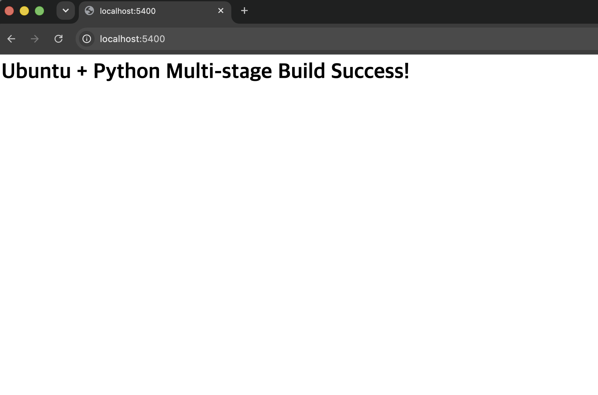
```shell
curl localhost:5400                                                                                                               ok  22:35:12

<h1>Ubuntu + Python Multi-stage Build Success!</h1>%
```

### 도커 컴포즈
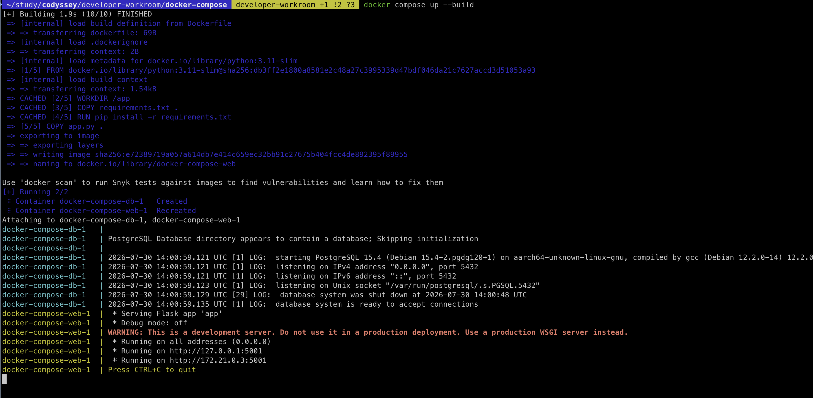
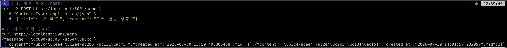

영속성 데이터 확인
```shell
docker volume ls | grep memo-data                                                                          255|127 err  23:06:26
local     docker-compose_memo-data
```

서버 재실행 후 데이터 존재 여부 확인
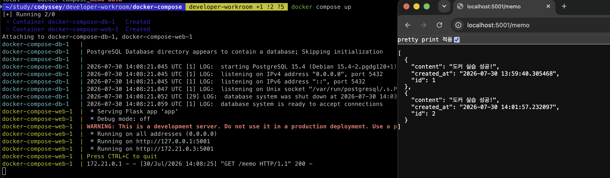

### 도커 볼륨 영속성 검증
- 도커 볼륨을 생성하고 컨테이너에 연결
- 컨테이너 삭제 전/후 데이터를 확인하여 데이터가 유지됨을 증명
- 기술 문서에 생성/연결/검증 절차(명령+출력)을 포함

### 도커 컴포즈 기초
- 단일 서비스를 Compose 로 실행

### 멀티 컨테이너
- 웹서버 + 보조 서비스 2개 이상을 Compose 로 함께 실행
- 컨테이너 간 네트워크 통신이 가능한지 확인

### Compose 운영 명령어
1. 백그라운드 실행
```shell
docker compose up -d
[+] Running 2/2
 ⠿ Container docker-compose-db-1   Started                                                                                                                                                                 0.3s
 ⠿ Container docker-compose-web-1  Started
```

2. 상태 확인
```shell
docker compose ps
NAME                   COMMAND                  SERVICE             STATUS              PORTS
docker-compose-db-1    "docker-entrypoint.s…"   db                  running             5432/tcp
docker-compose-web-1   "python app.py"          web                 running             0.0.0.0:5001->5001/tcp
```

3. 특성 서비스 로그
```shell
ocker compose logs web --tail 5
docker-compose-web-1  | WARNING: This is a development server. Do not use it in a production deployment. Use a production WSGI server instead.
docker-compose-web-1  |  * Running on all addresses (0.0.0.0)
docker-compose-web-1  |  * Running on http://127.0.0.1:5001
docker-compose-web-1  |  * Running on http://172.21.0.3:5001
docker-compose-web-1  | Press CTRL+C to quit
```

4. 종료
```shell
docker compose down
[+] Running 3/2
 ⠿ Container docker-compose-web-1  Removed                                                                                                                                                                10.2s
 ⠿ Container docker-compose-db-1   Removed                                                                                                                                                                 0.1s
 ⠿ Network docker-compose_default  Removed
```


## 트러블슈팅
### 포트 충돌
#### 문제
```shell
docker compose up --build

Error response from daemon: Ports are not available: 
exposing port TCP 0.0.0.0:5000 -> 0.0.0.0:0: 
listen tcp 0.0.0.0:5000: bind: address already in use
```

#### 원인 가설
docker-compose.yaml 에서 선언한 포트(5000)를 다른 프로세스가 이미 점유 중

#### 확인
```shell
lsof -i :5000
COMMAND     PID        USER   FD   TYPE DEVICE SIZE/OFF NODE NAME
ControlCe  1232  seunghyeon  11u  IPv4  0x8e73c5df8c85b72  0t0  TCP *:commplex-main (LISTEN)
ControlCe  1232  seunghyeon  12u  IPv6  0xd33ad895b2ca0704 0t0  TCP *:commplex-main (LISTEN)
```
PID 1232 의 ControlCe 프로세스(macOS Control Center)가 5000번 포트 점유 중

#### 해결
```yaml
# docker-compose.yaml 포트 변경
services:
  web:
    ports:
      - "5001:5000"  # 5000:5000 → 5001:5000
```
```shell
# 재실행
docker compose up --build
```

### 빌드 캐시
#### 문제
```shell
docker compose up --build

[+] Building 7.6s (10/10) FINISHED  # 1차 빌드
[+] Building 1.1s (10/10) FINISHED  # 2차 빌드
```

#### 원인가설
app.py 만 수정했는데 pip install 까지 다시 실행되면 매번 수십 초 낭비

레이어 순서에 따라 캐시 무효화 범위가 달라질 수 있음

#### 확인
```shell
# 2차 빌드 로그
=> CACHED [2/5] WORKDIR /app          # ✅ 캐시 사용
=> CACHED [3/5] COPY requirements.txt # ✅ 캐시 사용
=> CACHED [4/5] RUN pip install       # ✅ 캐시 사용
=> [5/5] COPY app.py .                # 🔄 app.py 변경 → 재실행
```
requirements.txt 변경 없음 → pip install 캐시 그대로 사용

app.py 변경 → 해당 레이어부터 재실행

#### 해결
```shell
# Dockerfile 레이어 순서를 의도적으로 설계
COPY requirements.txt .       # 3번째: 자주 안 바뀜
RUN pip install -r requirements.txt  # 4번째: requirements 변경 시만 재실행
COPY app.py .                 # 5번째: 자주 바뀜 → 마지막에 배치
```